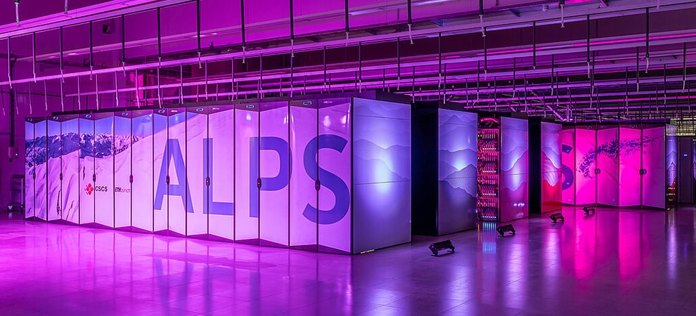
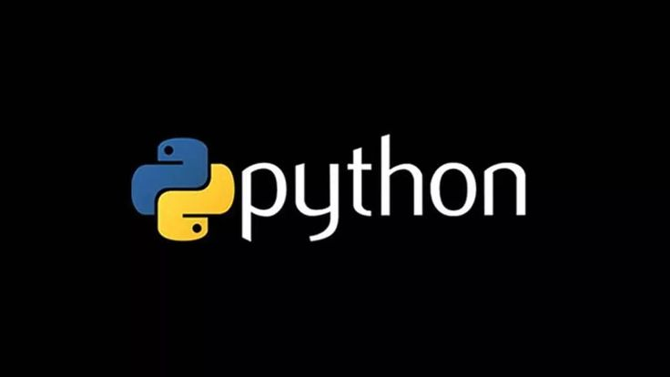
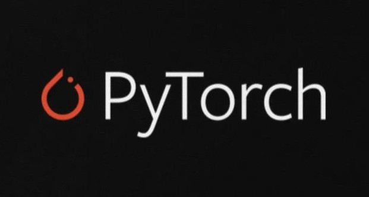

<h1 align="center">Shaswat Gupta</h1>

  

  <em>Engineering intelligence through code and cognition</em>

<strong>Why stop scrolling?</strong>

Dive into a portfolio that fuses research-grade machine learning with practical engineering. This repository hosts the source code for <a href="https://shaswat.dev">shaswat.dev</a>, where you can explore:

<ul>
  <li>Projects solving real-world problems</li>
  <li>Concise course notes distilled from hours of study</li>
  <li>Analyses on the state of AI and startups</li>
  <li>A snapshot of who I am and how I work</li>
</ul>

<strong>Projects Showcase</strong>

View the full collection under <a href="/projects/">/projects/</a>.

<table>
  <tr>
    <td></td>
    <td><strong>PyRecover</strong> – Distributed checkpointing &amp; job management for SLURM clusters.</td>
  </tr>
  <tr>
    <td></td>
    <td><strong>Neural Latent Representations</strong> – Exploring the hidden spaces within deep models.</td>
  </tr>
</table>

<strong>Courses</strong>

Notes and mini-guides written while teaching myself and others.

<table>
  <tr>
    <td></td>
    <td><strong>Engineering with Python</strong> – Best practices for real-world software.</td>
  </tr>
  <tr>
    <td></td>
    <td><strong>PyTorch Deep Learning</strong> – Hands-on neural network design.</td>
  </tr>
</table>

<strong>Analyses &amp; Essays</strong>

Sharp takes on AI trends and the startup ecosystem.

<ul>
  <li><a href="/analyses/ai_ecosystem/">AI at the Helm</a> – Signals from the Stanford AI Index.</li>
  <li><a href="/analyses/swiss-startup-ecosystem/">Swiss Startup Ecosystem</a> – Lessons from Europe&apos;s innovation hub.</li>
</ul>

<strong>About Me</strong>

Rank 1 graduate from IIT Bombay and MSc from ETH Zürich. I&apos;ve built ML systems that saved millions, collaborated across finance and healthcare, and earned recognition from Mensa International. Want the full story? <a href="/cv/">See my CV</a>.

  <a href="https://shaswat.dev">Visit the site →</a>

