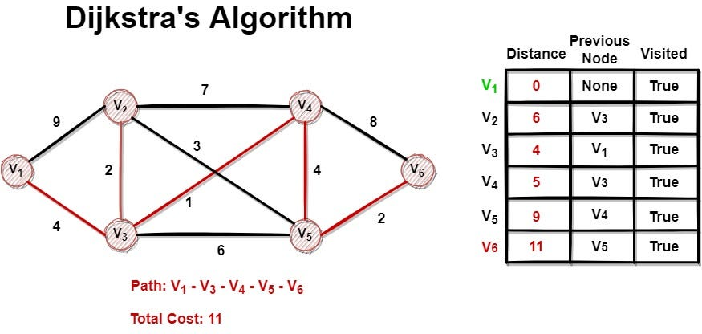

**By [Shaswat Gupta](https://www.linkedin.com/in/shaswat-gupta/) &mdash; [Email](/contact/)**

[View DSA Course on GitHub](https://github.com/Shaswat-G/dsa)



_A comprehensive, code-driven DSA course for students and professional developers._

## Why DSA Matters

Data Structures and Algorithms (DSA) are the backbone of computer science and software engineering. This course bridges the gap between theory and practical engineering—helping you:

- Build efficient, scalable software
- Ace technical interviews and coding rounds
- Recognize and apply patterns to real-world problems
- Write clean, maintainable, and robust code

## What's Inside

Five carefully structured learning modules with practical applications:

- **Foundations** — Core concepts, arrays, and DSA basics
- **Classic Data Structures** — Arrays, Linked Lists, Queues, Trees, Heaps, Hashing
- **Algorithms & Patterns** — Sorting, searching, recursion, backtracking, graph algorithms
- **Low-Level Design** — OOP, design patterns, and system design interview prep
- **Pythonic DSA** — Idiomatic Python, best practices, and tips

## Thoughtfully Designed Resources

This isn't just documentation—it's a complete learning system:

- **Comprehensive Notes** — Clear explanations with practical examples in each module
- **Reference Cheat Sheet** — Essential code patterns and interview tips
- **Visual Diagrams** — Strengthen your mental model of DSA topics

## Learn Your Way

Whether you're a student or a working engineer:

1. Follow the structured path from basics to advanced techniques
2. Jump to specific modules to address immediate challenges
3. Keep the cheat sheet handy during your daily work
4. Revisit diagrams to reinforce how concepts interconnect

## Practical Value

This course focuses on the DSA skills developers actually use daily—not just algorithms, but workflows and strategies that solve real problems and improve your efficiency.

## Repository Structure

- `DSA_Intro/` — Foundations, arrays, and core concepts
- `Arrays/`, `LinkedLists/`, `Queues/`, `Trees/`, `Heaps/`, `Hashing/`, `Sorting/`, `Recursion/`, `Graphs/` — Each topic contains:
  - `notes.md`: Theory, patterns, and interview tips
  - `*.py`: Idiomatic Python implementations and sample problems
- `Low-Level-Design/` — OOP and design patterns for system design interviews
- `Python/` — Pythonic DSA idioms and best practices
- `assets/` — Visuals and diagrams

## Getting Started

1. Clone the repository:

   ```sh
   git clone https://github.com/Shaswat-G/dsa.git
   cd dsa
   ```

2. Explore by topic:

   - Read `notes.md` in each folder for theory and interview patterns
   - Run and modify `*.py` files for hands-on practice

3. Use the curated LeetCode/interview problem lists in each notes file for targeted practice.

## Sample Usage

```python
from Heaps.heaps import MinHeap
h = MinHeap()
h.insert(5)
h.insert(2)
h.insert(8)
print(h.extract_min())  # 2

from Graphs.graphs import Graph
G = Graph(5)
G.add_edge(0, 1)
G.add_edge(1, 2)
print(G.bfs(0))
```

## Topics Covered

- Arrays, Linked Lists, Stacks, Queues, Trees, BSTs, Heaps, Hashing, Sorting, Graphs, Recursion, LLD, and more
- Each topic: Clean code, edge cases, patterns, and real-world applications

## Contributing

Your insights can help improve this resource. Open an issue or submit a pull request if you have suggestions for enhancement.

## License

Released under the MIT License. See [LICENSE](/assets/files/MIT_License.md) for details.

---

_Ace your interviews. Master the patterns. Write clean code._

[View DSA Course on GitHub](https://github.com/Shaswat-G/dsa)
